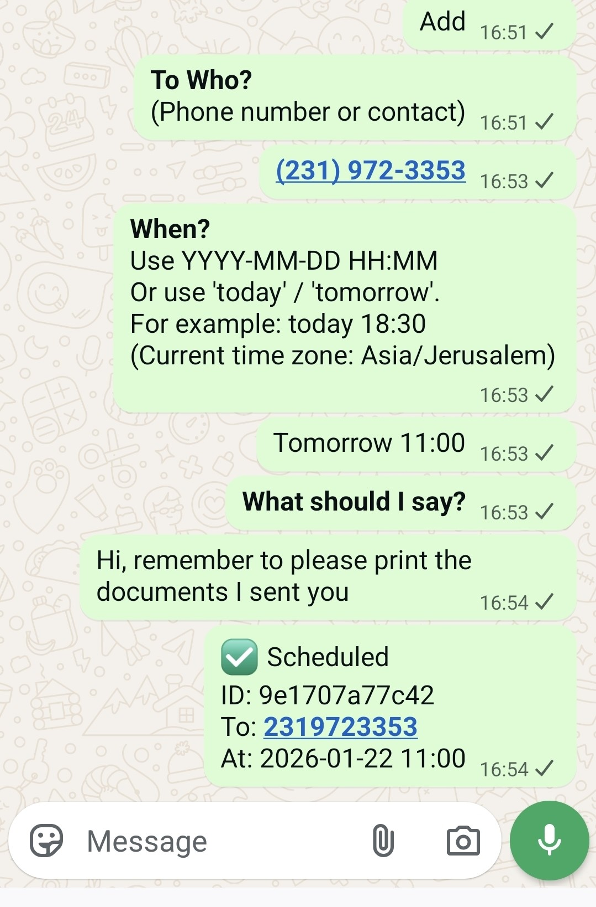

# Personal WhatsApp Assistant 🤖📰⏱️

#### A self-hosted, modular AI concierge for message automation and intelligent link summarization.
This suite turns WhatsApp into a proactive assistant. Instead of relying on your memory or getting distracted by link-spam, use a suite of microservices to manage your communication.

- ⏱️ **Message Scheduler:** Never miss a "Happy Birthday" or a deadline again. Schedule messages to individuals or groups with a simple chat-based interface.

- 📰 **Smart Summarizer:** Save hours of reading. Get instant, AI-generated TL;DRs of shared articles directly in the chat.

- 🏗️ **Modular Design:** Built on a broadcast architecture — easily add your own custom features without touching the core connection logic.

### Demo

| Link Summarizer | Message Scheduler |
| :---: | :---: |
|  |  |
---

## 🚀 Getting Started
#### 1. Prerequisites
- **Docker & Docker Compose** installed.
- An **OpenAI API Key** (for the summarizer, not necessary for just the scheduler).
- A WhatsApp account to link (a secondary account is recommended).

#### 2. Installation & Configuration
1. **Clone the repository:**
```bash
git clone https://github.com/yedidyatob/WhatsAppLinkReader.git
cd WhatsAppLinkReader
```
2. **Prepare environment variables:**

```bash
cp .env.example .env
```
Edit `.env` and provide your `OPENAI_API_KEY` and `DEFAULT_TIMEZONE` (e.g., `Asia/Jerusalem`).

3. **Launch the suite:**
```bash
docker compose up --build
```

#### 3. Initialization (The "Handshake")
1. **Link your account**: Watch the gateway logs (`whatsapp-gateway`) and scan the QR code with your WhatsApp app.

2. **Claim Admin rights:** Find the `admin_setup_code` in the logs. In WhatsApp, send the bot a private message: `!whoami <your_code>`.

3. **Activate in groups:** To enable features in a specific group, send:

- `!setup timed messages`

- `!setup summarizer`

4. **Assistant mode (optional):** Set `WHATSAPP_ASSISTANT_MODE=true`. Each user must DM the bot `!auth` to generate a personal auth code (printed in logs). The admin shares that code, and the user completes auth with `!auth <code>`. Approved numbers are stored in `config/common_runtime.json` under `approved_numbers`.

## 📱 How to Use

| Feature          | Usage                                                                                     |
|------------------|-------------------------------------------------------------------------------------------|
| **Schedule Message** | Type `add`. The bot will guide you through an interactive flow to set the content and time. |
| **Manage Schedule**  | Use `list` to see pending messages. To delete one, simply **Reply** to the bot's "Scheduled..." confirmation message with the word `cancel` .                             |
| **Summarize Link**   | Tag the bot with `@bot` in a message with a link, or **Reply** to any link with `@bot`.           |

---

## ⚙️ Technical Deep Dive

#### Asynchronous Microservices Architecture
This suite operates on a **decoupled push-pull model**, ensuring the WhatsApp connection remains stable even during heavy processing or long wait times.

1. **The Broadcast:** When a message arrives, the **Gateway (Node.js)** sends an HTTP POST (Webhook) to all service URLs in `WHATSAPP_EVENT_TARGETS`.

2. **The Processing:** Services (Python) process the data independently.

- **Timed Messages Service:** Monitors a **PostgreSQL** database. A dedicated worker "sleeps and polls" the DB to trigger message delivery with high reliability.

- **Summarizer Service:** Uses **Playwright** to render JS-heavy sites and **Trafilatura** for text extraction before calling the OpenAI API.

3. **The Callback:** When a service is ready to reply, it calls the Gateway's `/send` endpoint with `{ "to": "<chat_id>", "text": "..." }`. This allows tasks to take as long as they need without blocking the Gateway.

#### Persistence Layers
- **Relational Data: PostgreSQL** stores the message queue for the scheduler, ensuring your tasks survive a container restart.
- **Contextual Commands:** The Timed Messages service tracks the Message IDs of its confirmations. When a user replies cancel to a specific confirmation, the service retrieves the linked task from PostgreSQL and removes it, allowing for precise management.

- **Hot-Reloading Config**: Group permissions and Admin settings are stored in shared `/config` JSON files allowing updates without restarts.

- **Session State:** Saved in the `/auth` volume to persist the WhatsApp Web login.

### 🛠️ Extending the Suite (Add Your Own Service)
The architecture is designed for growth. You can add a new service (e.g., "Weather Alerts" or "Stock Tracker") in minutes.

1. **Create your worker**
Your service just needs to listen for a POST request, and call the Gateway's `/send` endpoint when it wants to talk back.

```python
# Quick Python Example
import requests
from fastapi import FastAPI, Request

app = FastAPI()
GATEWAY_URL = "http://whatsapp-gateway:3000/send"

@app.post("/whatsapp/events")
async def handle_event(request: Request):
    data = await request.json()
    if (data.get("text") or "").strip().lower() == "!ping":
        requests.post(GATEWAY_URL, json={"to": data.get("chat_id"), "text": "Pong! 🏓"})
    return {"status": "ok"}
```

2. **Update Environment**
Append your new service URL to `WHATSAPP_EVENT_TARGETS` in your `.env`.

## 🩺 Troubleshooting
If you are logged out of WhatsApp or get a connection error loop,
remove the auth folder and reconnect:
```bash
rm -rf auth
```

---

## ⚠️ Disclaimer & License
**MIT License.** This project is for educational use and uses an unofficial WhatsApp API. Use responsibly to avoid account flagging.
