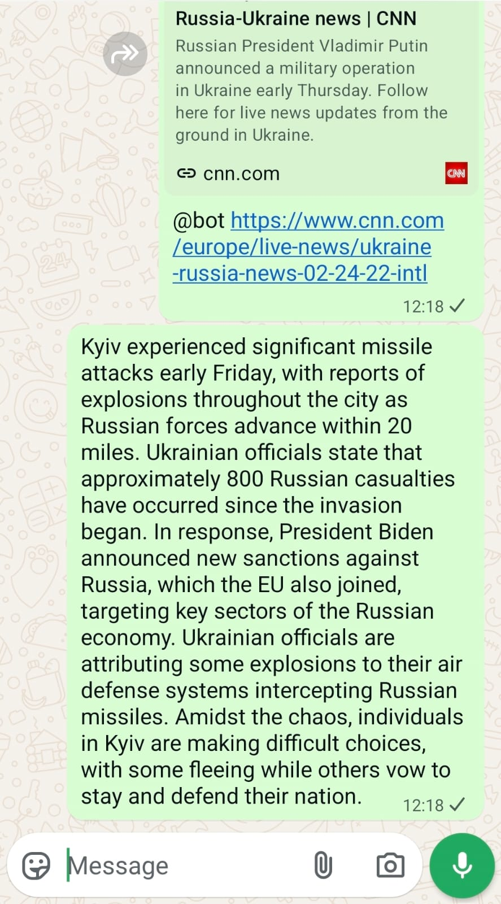

# WhatsApp Link Reader & Summarizer Bot 🤖📰

#### Tired of opening all the news articles people send in WhatsApp groups?
This bot listens to WhatsApp messages, detects shared links, fetches the linked content, and generates short summaries using a large language model.

The goal is simple:  
**Turn link spam into readable summaries.**

---

## 🧠 What It Does

- Listens for incoming WhatsApp messages
- Detects URLs in messages
- Fetches and cleans article content
- Generates concise summaries using an LLM
- Returns the summary directly in the chat

Think of it as a lightweight **WhatsApp news reader**.

**Demo:**


---

## 🏗️ High-Level Architecture

The system runs as two services:

### 1. WhatsApp Listener (Node.js)
- Built on **Baileys** (WhatsApp Web client)
- Handles login, message events, and replies
- Automatically reconnects if the connection drops

### 2. Summarization Service (Python)
- Extracts URLs from text
- Fetches article content using **Playwright** (handles dynamic JS sites)
- Extracts clean text using **Trafilatura** (with JSON-LD fallback)
- Calls **OpenAI GPT** to generate summaries

Both services are orchestrated with **Docker Compose**.

---

## ⚙️ Configuration & Usage

### 1. Clone the Repository
```bash
git clone https://github.com/yedidyatob/WhatsAppLinkReader.git
cd WhatsAppLinkReader
```

### 2. Environment Variables
This project uses environment variables for secrets and configuration.
An example file is provided:
```bash
cp .env.example .env
```
Edit `.env` and provide the required values:

- `OPENAI_API_KEY` – API key for the LLM used for summarization (GPT)
- `SETUP_MODE` - `true`/`false`. Set to `true` on first launch to print chat IDs to the console.
- `ALLOWED_GROUPS` - Comma-separated list of group IDs where the bot is active.

### 3. Running
```bash
docker compose up --build
```
On the first run, the WhatsApp client needs to authenticate.
- A QR code will be printed to the terminal.
- Scan it using the WhatsApp mobile app (Linked Devices).
- Authentication data will be saved locally in the `auth/` folder.

**Finding Group IDs:**
If you run in `SETUP_MODE=true`, send a message in the target group. The bot will print the group ID to the console. Copy it and paste it into the `.env` file under `ALLOWED_GROUPS`.

Then stop the project (`CTRL+C`), change `SETUP_MODE` to `false`, and run again:
```bash
docker compose up -d
```
You're set up!

### 4. Usage
To use the bot, use the key phrase **"@bot"**.
- **Direct Message:** Send a message containing a link and `@bot`.
- **Reply:** Reply to a message containing a link with `@bot`.

The bot will process the link and reply with a summary.

#### Troubleshooting
If you are logged out of WhatsApp or get a connection error loop,
remove the auth folder and reconnect:
```bash
rm -rf auth
```

---

## ⚠️ Disclaimer

> **This project is for educational and experimental purposes only.**

- Uses unofficial WhatsApp Web behavior.
- Not affiliated with or endorsed by WhatsApp.
- May violate WhatsApp’s Terms of Service if misused.
- You are responsible for legal and platform compliance.

---

## 📄 License

This project is licensed under the **MIT License**.  
See the `LICENSE` file for details.
